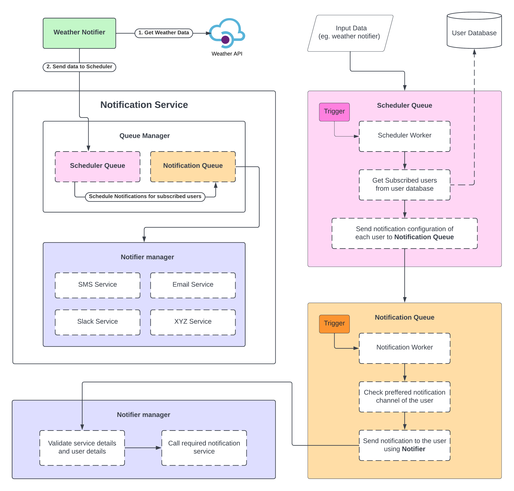
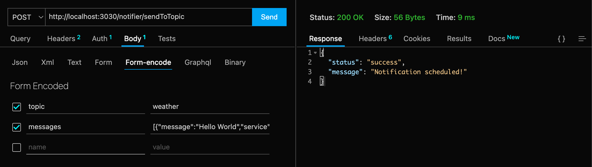

# Notifiation Service

This is a notification service that can send multi channel bulk notifications.

---

## 💬 Content

### Workflow Diagram:



### Technologies, Services and Libraries used:

<ul>
  <li><b>Express</b>: Web server</li>
  <li><b>Bull</b>: Queue manager</li>
  <li><b>Axios</b>: HTTP client</li>
  <li><b>Redis</b>: for Bull (queue management)</li>
  <li><b>Twilio</b>: SMS service provider</li>
  <li><b>Mailjet</b>: Email service provider</li>
</ul>

---

## 🏃‍♂️ How to Start

1. Create `.env` file on the project directory and copy the content from the given link.
2. Install dependencies: `yarn install`
3. Run the server: `yarn dev`
4. To run unit tests, run: `yarn test`
5. **Please read the next section** to know more about the service and triggers ⬇️⬇️⬇️

---

## ⚠️ Important Notes

- If `.env` file content is copied from the given link, it should contains all the **API keys** needed to connect to the **Redis Cloud Server** (free trial), **Twilio SMS service** (free trial) and **MailJet mail service** (free trail).
- Kindly **change the phone and email** on the user database to receive the notifications. Know More here, [User Database](https://github.com/BRoy98/StackNotifier#1-user-database).
- Check the [Routinely check and send notifications](https://github.com/BRoy98/StackNotifier#2-routinely-check-and-send-notifications) to know how to **periodically trigger the notification service**.

---

## 📙 Features Brief

### 1. User Database:

- A json file is considered as the users database, which can be found at `data/users.json`
- Database structure:

```
{
    "name": "Test User",
    "sms": "+911234567890",
    "email": "testuser@gmail.com",
    "subscriptions": [
      {
        "topic": "weather",
        "method": "sms"
      }
    ]
  }
```

### 2. Routinely check and send notifications:

- To demonstrate this feature, a weather notification service is available, which periodically checks for current weather temperature and sends it to all the subscribed users.
- To start the weather notifier, set `RUN_WEATHER_NOTIFIER=true` on `.env`
- It is a cron job which triggers the notifier periodically.
- Trigger frequency can be modified on the `index.ts` file at `line number 8` by passing cron expressions on to the function `weatherSchedule`.
- Here are some useful cron expressions that can be used:
  - `*/30 * * * * *` : trigger every 30 second
  - `*/1 * * * *` : trigger every minute
  - `*/5 * * * *` : trigger every 5 minute
- Please note, very less frequency triggers can cause sending multiple sms and emails to the recipient address.

### 3. Flexible to accommodate new mediums:

- SMS and Email service is implemented on the current version of the application. SMS service uses Twilio and Email service uses MailJet.
- Services are dynamically managed by the `NotifierManager` which keeps track of all the registered notification mediums.
- Because of it's plugin like structure, any new notification mediums can be added very easily with few lines of code.

### 4. Send notification using a selected medium:

- Notification sending process is managed by a Queue Manager (Bull). It helps in keeping track of all the scheduled notifications and bulk sending process.
- Ad-hoc notification sending process is also available. Please refer to the [Send ad-hoc notifications](https://github.com/BRoy98/StackNotifier#6-send-ad-hoc-notifications) section.

### 5. Retry send a notification if failed due to some code exception:

- Bull is setup to retry each notification 5 times in case of failure, in 1 seconds interval. In case all 5 tries are failed, it rejects the notification. The retry configuration is customizable.

### 6. Send ad-hoc notifications

- Ad-hoc notifications can be sent using the REST APIs. More details about the REST APIs can be found in the [REST APIs](https://github.com/BRoy98/StackNotifier#-rest-apis) section.

### 7. Easy to test:

- Each part of the application is defined in a separate module. The entire Notification Service has two main modules.
  - Notifier
  - Scheduler
- Unit test files are available in the `test` directory. Service specific unit test files are available in their respective directories inside `services/`.
- More details about the working process of the modules can be found on the [Workflow Diagram](https://github.com/BRoy98/StackNotifier#workflow-diagram) added at the top of the page.

---

## 💻 REST APIs

for sending ad-hoc notifications

## Send a single notification

### Request

`POST /notifier/send`

    curl -X POST \
    'http://localhost:3030/notifier/send' \
    --header 'Accept: */*' \
    --header 'Content-Type: application/x-www-form-urlencoded' \
    --data-urlencode 'service=sms' \
    --data-urlencode 'message=Hello World' \
    --data-urlencode 'to=${your_mobile_number}'

### Response

    HTTP/1.1 200 OK
    Date: Sun, 24 Apr 2022 20:28:58 GMT
    Status: 200 OK
    Connection: close
    Content-Type: application/json; charset=utf-8
    Content-Length: 23
    x-powered-by: Express

    {
      "status": "success",
      "message": "Notification sent!"
    }


## Send bulk notification to a topic

### Request

`POST /notifier/sendToTopic`

    curl -X POST \
      'http://localhost:3030/notifier/sendToTopic' \
      --header 'Accept: */*' \
      --header 'Content-Type: application/x-www-form-urlencoded' \
      --data-urlencode 'topic=weather' \
      --data-urlencode 'messages=[{"message":"Hello World","service":"sms"},{"message":"Hello Folks, How are you doing?","service":"email"}]'

### Response

    HTTP/1.1 200 OK
    Date: Sun, 24 Apr 2022 20:28:58 GMT
    Status: 200 OK
    Connection: close
    Content-Type: application/json; charset=utf-8
    Content-Length: 56
    x-powered-by: Express

    {
      "status": "success",
      "message": "Notification scheduled!"
    }



---

Thank you for reading.
